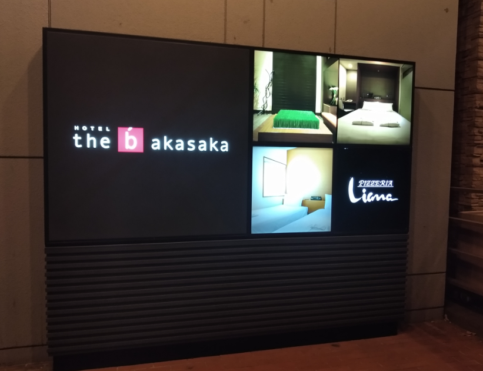
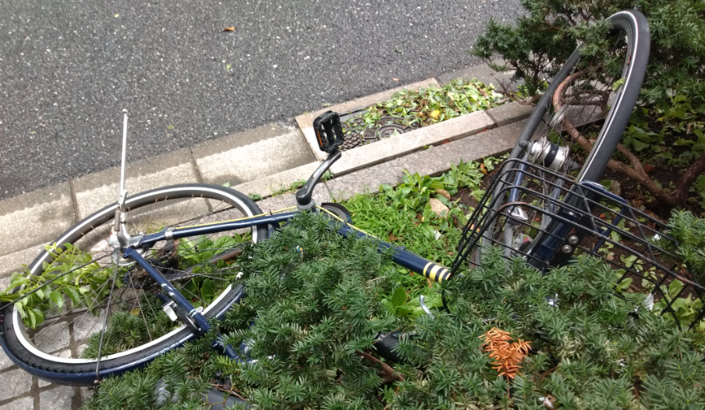
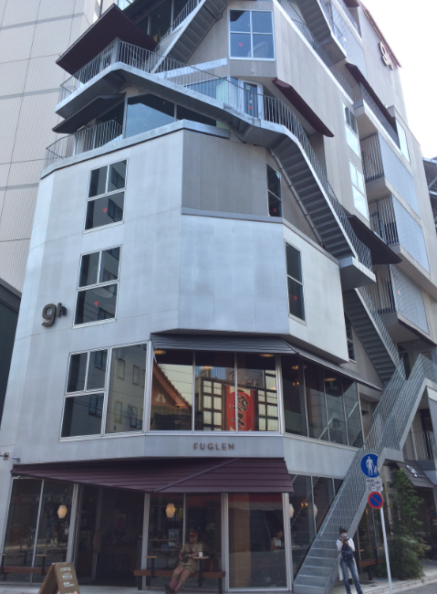
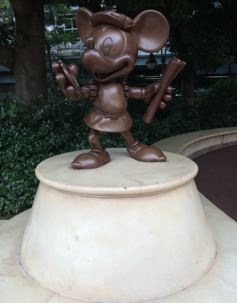
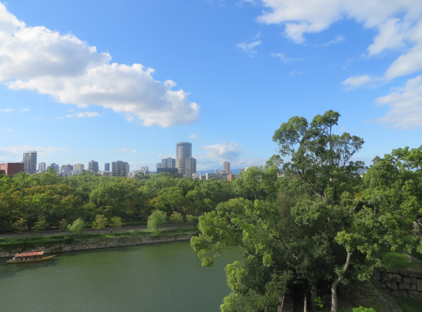
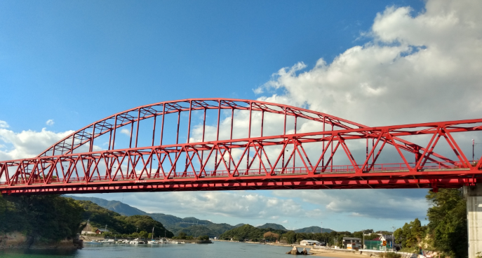

I posted quite a lot about my trip to Japan on Facebook, but never got around to posting it here (that's what not having a day off since September does). The following is what I wrote at the time (with light editing where required), and there are also more pictures from the cycle tour of the Japanese islands on [my cycling blog](https://andy.teknostatik.co.uk/cycling/2019/12/07/cycling-the-shimanami-kaido/).

## Monday 9th September

Its the early hours of Monday morning, and I’m sitting in a beautifully air conditioned room in Tokyo. It is nearly 6am, and jet lag has been banished by three hours of sleep on the plane and then an early night last night. In fact I think we’re about 2 hours ahead of ourselves now, which fits quite nicely with the dark nights and light mornings of Japan.

The only problem is the storm. It’s sitting right over us and doesn’t show much sign of moving for at least the next hour or so. But we have coffee, hotel breakfast, and all the delights that the hotel vending machines have to offer, and we stocked up on food in between the initial downpour of yesterday evening and the overnight storm that is raging directly above us.

Apart from that all is well. The flight was great, I saw two movies I’d missed at the cinema (The Girl in the Spider’s Web and Murder on the Orient Express), and whilst the Tokyo subway resembles one of Dante’s circles of hell it is no worse than what we have back home.

The first hotel we stayed in

(a few hours later)

I’m back in the hotel room after a few hours of adventures. We have eaten breakfast and lunch, rescued several bikes from the storm (by putting them upright again - I don’t like to see bikes that look unloved or otherwise out of place), visited a woodland shrine, and wandered around the shops in the sort of blistering heart that makes me very thankful that most shops have air conditioning. We also had a much better experience of the subway today, which may have a lot to do with having slept and not carrying 2 weeks of luggage around.

A bike that required rescuing

## Wednesday 11th September

Another day another part of Tokyo, and this morning saw us lugging our bags from Asakusa to Disneyland during what seemed too early to be rush hour, so was probably just a series of busy trains.

The capsule hotel we stayed in

I’ve been known to be negative about all things Disney in the past, but I did have a lot of fun today, and went on a few rides that very much tapped into things I hold dear (Star Wars and Indiana Jones) rather than the aspects that I feel no cultural resonance with.

It was a hard day though. I don’t think we really stopped for about 15 hours, and that is probably going to come back to bite us tomorrow. We did manage to eat properly, but as with a lot of Japan the vegetarian options are limited, so I didn’t really get to experience much in the way of Japanese cuisine today (although pizza for breakfast and curry for dinner were ok).

Mickey Mouse

On the bright side, tonight is one of our luxury hotel nights, and both the hotel and the room are outstanding. I’ve enjoyed the budget hotels and hostels, but sometimes it’s nice to relax with a hot bath and a cold beer before bed.

Talking of which, it’s nearly midnight here…

## Thursday 12th September

Day two of the Disney adventure is now over. We didn’t get quite as much done as yesterday, but did take many more photographs and have now started to plan the next phase of the holiday which will see us bid farewell to Tokyo and head to Osaka for most of the rest of our time in Japan (although there will be several exciting day trips to other places, including a cycling adventure).

I could (and probably will) write much more about what I liked and didn’t like about Disney, but that will be a story for another day.

## Saturday 14th September

Our last full day in Tokyo involved a short trip from Disney to a capsule hotel in Tokyo city centre. It wasn’t quite as good as the one we stayed in a few nights ago, but it was good enough to grab a shower, catch up on sleep, and be up bright and early for the epic journey to Osaka via a very impressive and speedy train service. We also grabbed the best meal of the holiday so far at the vegan ramen restaurant in Tokyo station, which made a nice change after several days of not being sure exactly what I was going to be able to eat (Japan can be hard for vegetarians, as can Disney). I’m less worried about food now, as our hotel in the Yodoyabashi District of Osaka is right next door to a great restaurant that does the full range of Japanese modular food, so tonight I feasted on edamame, plum rice, tofu and mushrooms (with food already chosen for at least one more trip there). It’s also next door to a convenience store that sells noodles, snacks and drinks. The hotel itself is great, the mountain of washing is now done, and it’s nice to be sleeping in the same place for 5 nights in a row after a week of being in a different place most nights. If nothing else it will make for much lighter bags for the 4 days of adventures we have planned (including cycling between the Japanese islands on Tuesday and visiting Kobe and Kyoto over the next couple of days.

Osaka

After a week of backpacking it’s clear that most of the kit we bought with us was chosen well. The bags are holding up well, the two universal chargers that will handle 10 devices between them are getting a lot of use, and the portable wifi hotspot we have hired has proved invaluable for navigating between places. I’m finding using an iPad as my only computer to be fine, and I’ve also started using my old iPhone (which I bought here as a music player) because it’s a lot smaller than my current phone and has a really good camera. It’s interesting that a phone I had as part of a contract nearly 5 years ago is still serving me well on a trip like this, and I’ve very much been plugged into it during the capsule hotel evenings, largely listening to the excellent new records by Pixies and Belle & Sebastian.

## Wednesday 18th September

The last few days have been a blur of activity. We have visited the world’s largest aquarium and seen the world’s largest suspension bridge. We have seen modern skyscrapers juxtaposed with ancient temples, cycled the length of three Japanese islands (and the bridges that connect them) and encountered the horror that is the Universal Studios theme park. I do feel that we have done Osaka justice during these 5 days though, and I’ll be very sad to leave.

A bridge connecting 2 Japanese islands

But leave we must. The rest of the trip largely involves travel. Firstly a long train journey to get us back to Narita, and then (after a night in a capsule hotel at the airport) the plane home. It’s been a great adventure, and I’ll be very sorry to leave, but at the same time it will be good to be home.
